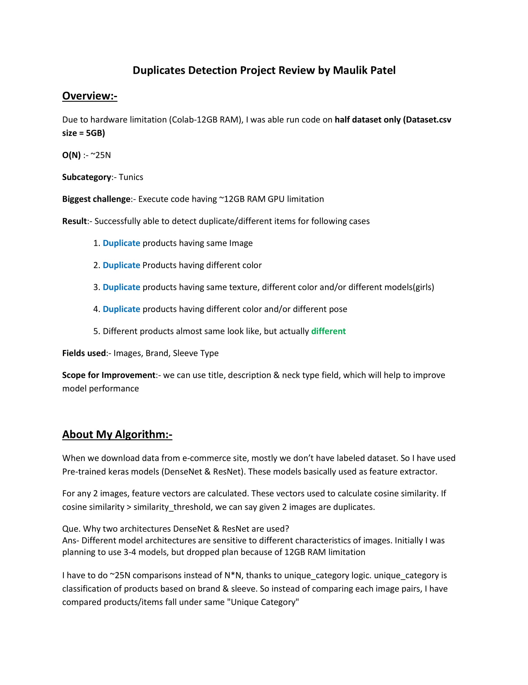
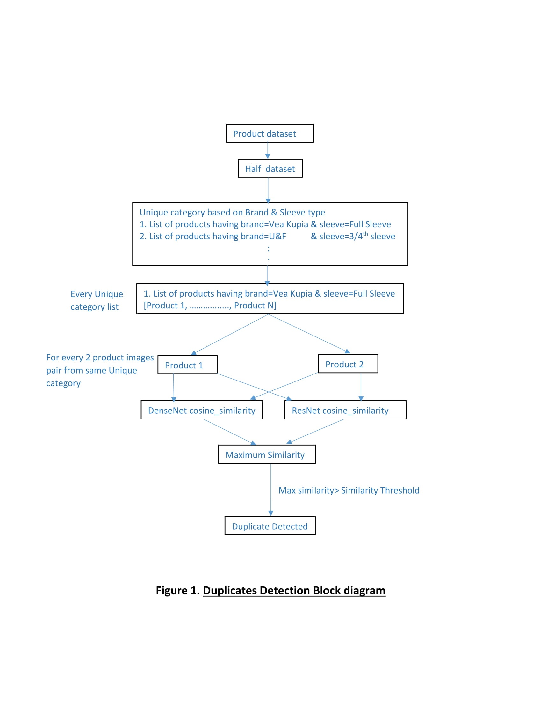
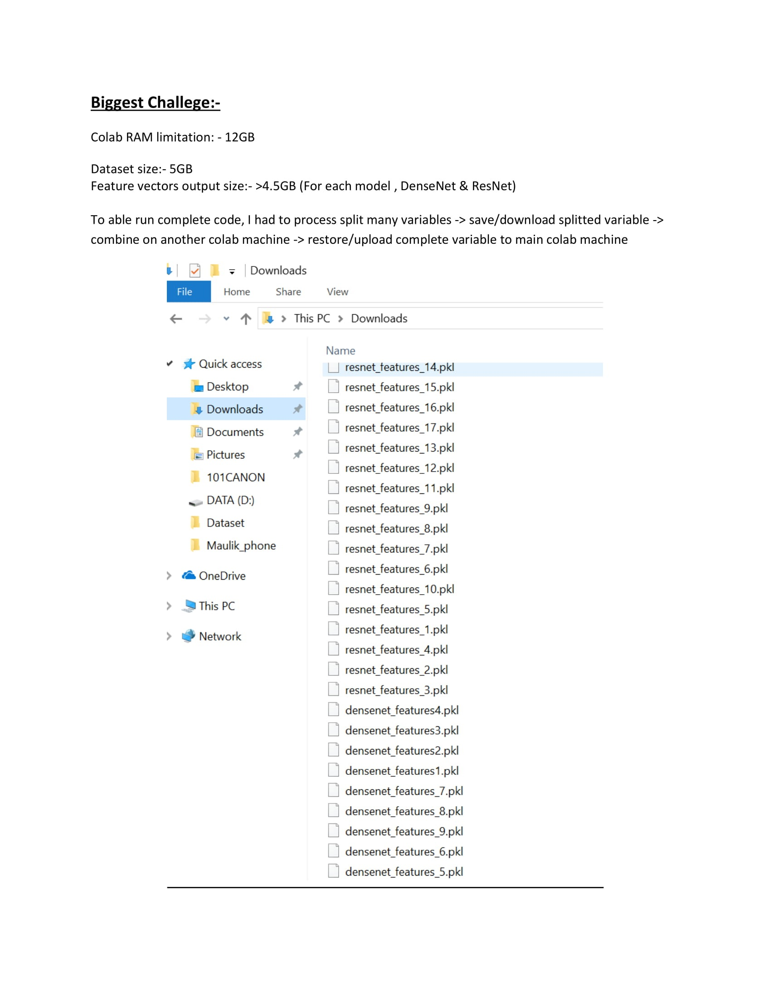
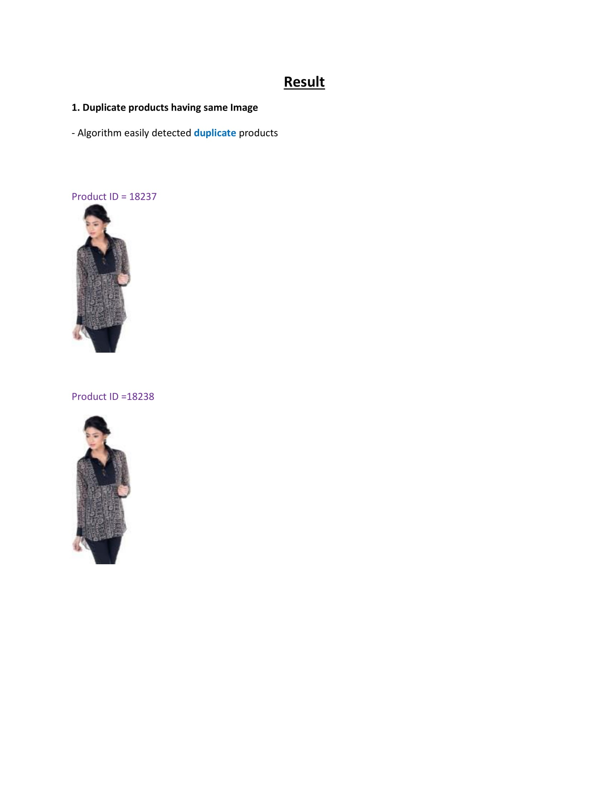
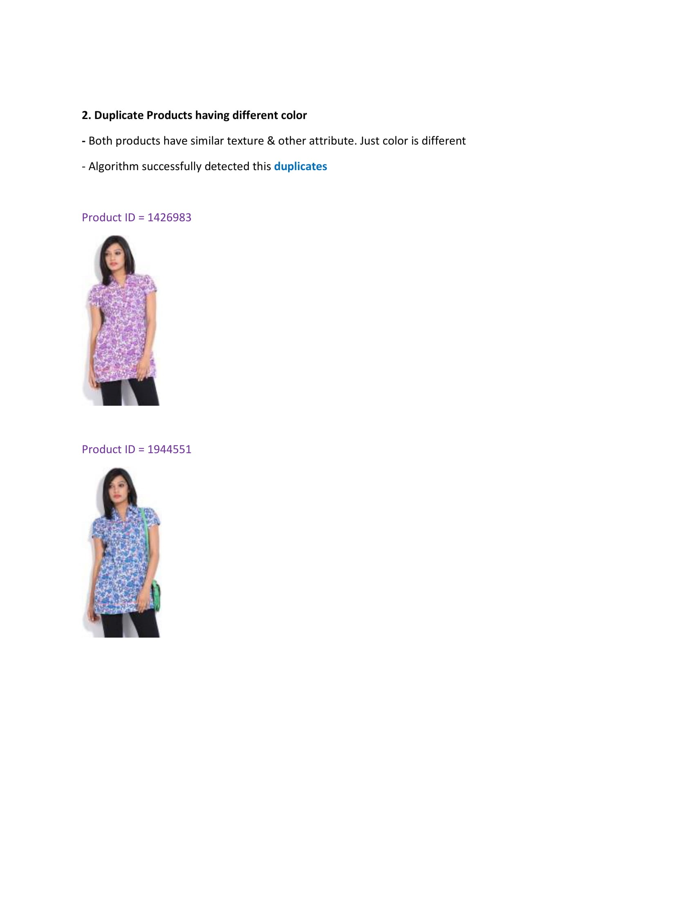
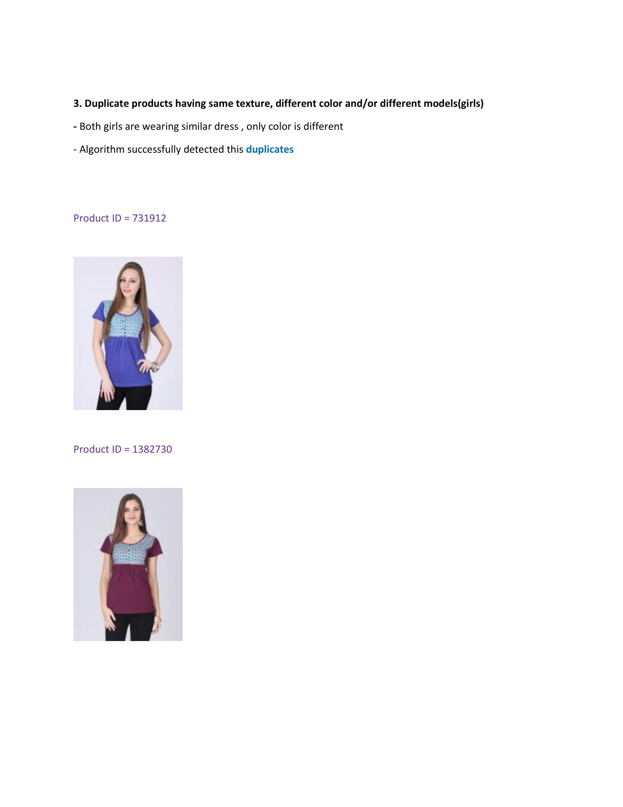
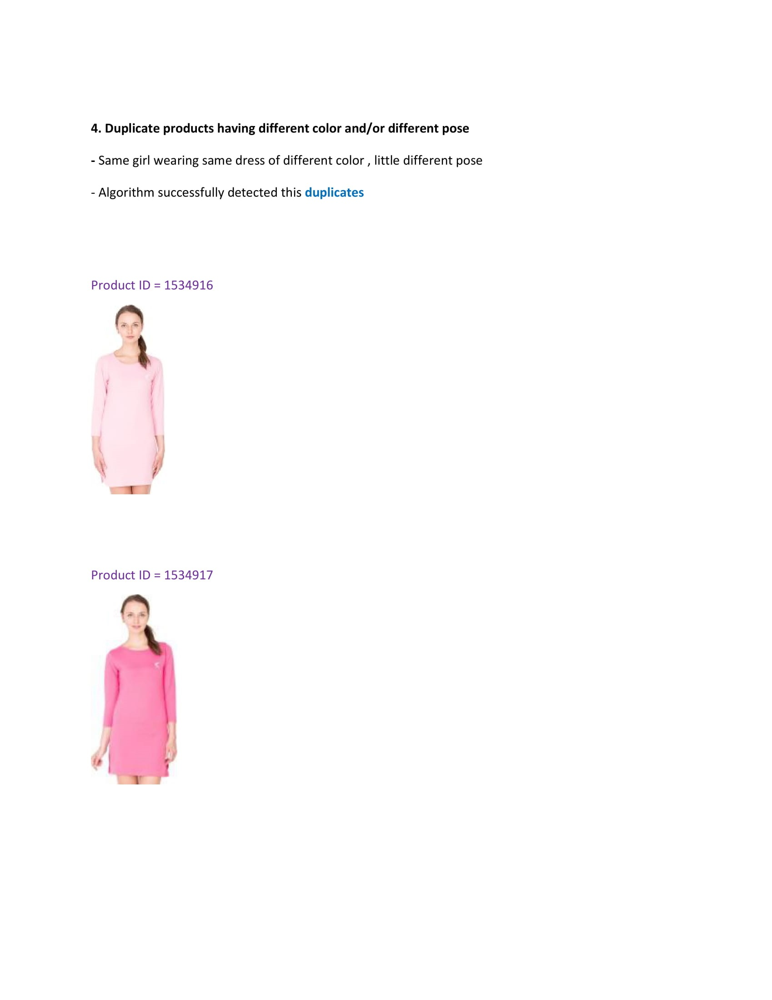
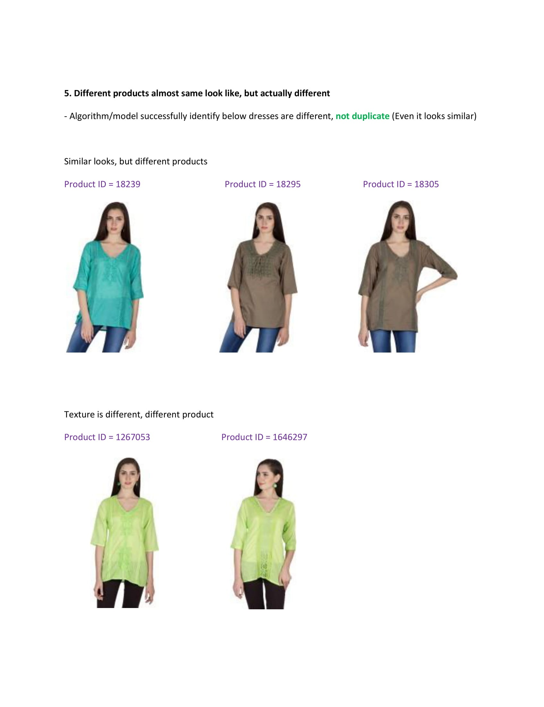

## **DuplicateDetection:**

Developed code which detect duplicate products listed on E-commerce
 website based on image similarity. Code also used other attributes like brand, sleeveless type to reduce code
complexity(O(N)) from N*N to ~25N. Dataset contain 2M+ products detail. 

I was successfully able to detect duplicate products. I have discussed
my results in Approach-DuplicateDetection.pdf

Also I discussed my approach in Approach-DulicateDetection.pdf

_Detected Duplicates Example:-_

